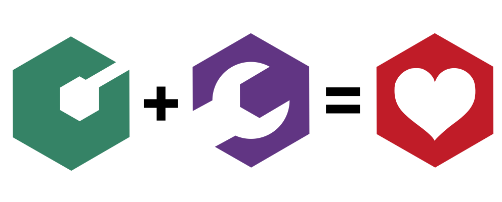

<h1> Toolenv</h1>

A simple utility to manage environments within toolbx.

## Installation

### COPR

You can use the provided COPR repository, by running:

```bash
sudo dnf copr enable pesader/toolenv
sudo dnf install toolenv
```

### RPM packages

RPM packages are available under the "Releases" section of the repository.
Download the package for your version of Fedora and install with the following
command (e.g. for Fedora Linux 38):

```bash
sudo dnf install $HOME/Downloads/toolenv-0.1.1-1.fc38.noarch.rpm
```

## How to use it

Toolenv's goal is to make it easy to create and use custom shell configurations (i.e. environments) for specific toolbxes. Here's the step-by-step tutorial:

1. Enter a toolbx
2. Run `toolenv create` to create an shell configuration for that toolbx
3. Run `toolenv edit` to edit the shell configuration you just created
3. Next time you enter that toolbx, that configuration will be automatically sourced by `toolenv`

It also distinguises between different shells (e.g. bash, zsh), so you can have different configurations for each.

## Why use it

Here are some possible use-cases:

- Setup CLI tools that are only installed in the toolbx (e.g. zoxide, direnv, etc)
- Use programming language environments in software development toolbxes
- Set debugging environment variables in software development toolbxes
- Change your `$HOME` directory within a toolbx

## Attribution

The logo of toolenv is inspired by the logo of toolbx, designed by [jimmac](https://github.com/jimmac) (Jakub Steiner). It's a cog the wrench!



## License

This work is licensed under the terms of the AGPLv3.
